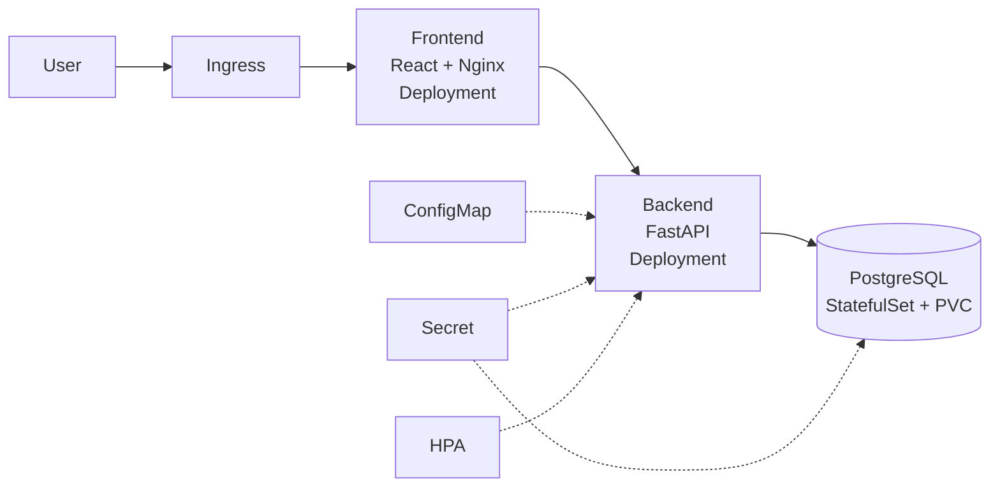

# Containerized-3-Tier-Notes-App-on-Kubernetes

A 3-tier application (React frontend, FastAPI backend, PostgreSQL database) containerized with Docker, orchestrated on Kubernetes, and packaged as a Helm chart for multi-environment deployment.

The application is intentionally small. The focus of this project is the **deployment pipeline**: containerization, orchestration, health checks, resource management, load testing, and configuration management.

**Tech stack:** Docker, Docker Compose, Kubernetes, Helm, Minikube, GKE (optional), FastAPI, React, PostgreSQL, k6, GitHub Actions

---

## Architecture



| Tier | Technology | Kubernetes Resource | Exposed via |
|------|-----------|---------------------|-------------|
| Frontend | React served by Nginx | Deployment (2 replicas) | Ingress |
| Backend | FastAPI (Python) | Deployment (2+ replicas, HPA) | ClusterIP Service |
| Database | PostgreSQL 16 | StatefulSet + PersistentVolumeClaim | ClusterIP Service |

---

## Key Features

- **Multi-stage Docker builds** with non-root users and `.dockerignore` for small, secure images
- **One-command local setup** with Docker Compose
- **Liveness and readiness probes** on `/health` for self-healing and safe rollouts
- **Resource requests and limits** on every container
- **Persistent storage** for PostgreSQL using a PVC, so data survives pod restarts
- **ConfigMap and Secret** separation of configuration and credentials
- **Horizontal Pod Autoscaler** scaling the backend under load
- **Helm chart** with `values-dev.yaml` and `values-staging.yaml` for environment-specific configuration
- **Load tested** with k6 while deliberately killing pods

---

## Project Structure

```
.
├── frontend/            # React app + Dockerfile + nginx.conf
├── backend/             # FastAPI app + Dockerfile
├── docker-compose.yml   # Local 3-tier setup
├── k8s/                 # Raw Kubernetes manifests
│   ├── namespace.yaml
│   ├── configmap.yaml
│   ├── secret.example.yaml
│   ├── postgres-statefulset.yaml
│   ├── backend-deployment.yaml
│   ├── frontend-deployment.yaml
│   ├── services.yaml
│   ├── ingress.yaml
│   └── hpa.yaml
├── helm/
│   └── notes-app/       # Helm chart
│       ├── Chart.yaml
│       ├── values.yaml
│       ├── values-dev.yaml
│       ├── values-staging.yaml
│       └── templates/
├── loadtest/
│   └── k6-script.js
└── README.md
```

---

## Prerequisites

- Docker and Docker Compose
- kubectl
- Minikube
- Helm 3
- k6 (for load testing)

---

## Quick Start

### 1. Run locally with Docker Compose

```bash
git clone https://github.com/<your-username>/<your-repo>.git
cd <your-repo>
docker compose up --build
```

- Frontend: http://localhost:3000
- Backend API docs: http://localhost:8000/docs
- Health check: http://localhost:8000/health

### 2. Deploy to Kubernetes (Minikube) with raw manifests

```bash
minikube start
minikube addons enable ingress
minikube addons enable metrics-server

# Build images inside Minikube's Docker daemon
eval $(minikube docker-env)
docker build -t notes-backend:1.0 ./backend
docker build -t notes-frontend:1.0 ./frontend

# Create the secret (never commit real credentials)
kubectl create namespace notes
kubectl -n notes create secret generic db-secret \
  --from-literal=POSTGRES_USER=notes \
  --from-literal=POSTGRES_PASSWORD=<choose-a-password> \
  --from-literal=POSTGRES_DB=notesdb

kubectl apply -n notes -f k8s/
kubectl -n notes get pods
```

Add the Minikube IP to your hosts file:

```bash
echo "$(minikube ip) notes.local" | sudo tee -a /etc/hosts
```

Then open http://notes.local

### 3. Deploy with Helm

```bash
# Dev environment (1 replica, low limits)
helm install notes-dev ./helm/notes-app \
  -f ./helm/notes-app/values-dev.yaml \
  --namespace dev --create-namespace \
  --set db.password=<choose-a-password>

# Staging environment (3 replicas, higher limits)
helm install notes-staging ./helm/notes-app \
  -f ./helm/notes-app/values-staging.yaml \
  --namespace staging --create-namespace \
  --set db.password=<choose-a-password>

# Upgrade and roll back
helm upgrade notes-dev ./helm/notes-app -f ./helm/notes-app/values-dev.yaml -n dev
helm rollback notes-dev 1 -n dev
```

---

## Health Checks and Reliability

| Probe | Endpoint | Purpose |
|-------|----------|---------|
| Liveness | `GET /health` | Restarts the container if the app hangs |
| Readiness | `GET /health` | Removes the pod from the Service until it can serve traffic (for example, until the DB connection is ready) |

**Resource configuration (backend example):**

| | Requests | Limits |
|---|----------|--------|
| CPU | 100m | 500m |
| Memory | 128Mi | 256Mi |

Requests let the scheduler place pods correctly. Limits stop one pod from starving others on the node.

### Failure experiments performed

- [ ] Deleted a backend pod during traffic and confirmed automatic recovery
- [ ] Broke the readiness probe on purpose and confirmed traffic stopped routing to that pod
- [ ] Performed a rolling update with zero failed requests
- [ ] Deleted the Postgres pod and confirmed data persisted via the PVC

*(Tick these off as you complete them, and add notes on what you observed.)*

---

## Load Testing Results

Tested with [k6](https://k6.io) while randomly deleting backend pods.

```bash
k6 run loadtest/k6-script.js
```

| Metric | Result |
|--------|--------|
| Virtual users | `<fill in>` |
| Duration | `<fill in>` |
| Total requests | `<fill in>` |
| Success rate | `<fill in>%` |
| p95 latency | `<fill in> ms` |
| HPA scaling | `<fill in> → <fill in> replicas` |

> Replace the placeholders with your real measured numbers before publishing.

---

## Setup Time Comparison

| Method | Time |
|--------|------|
| Manual setup (install Node/Python, PostgreSQL, dependencies, configure) | `<fill in> min` |
| `docker compose up` | `<fill in> min` |

---

## Helm Values Overview

| Value | Dev | Staging |
|-------|-----|---------|
| `backend.replicaCount` | 1 | 3 |
| `frontend.replicaCount` | 1 | 2 |
| `backend.resources.limits.cpu` | 250m | 500m |
| `backend.resources.limits.memory` | 128Mi | 256Mi |
| `ingress.host` | notes-dev.local | notes-staging.local |
| `autoscaling.enabled` | false | true |

---

## Secrets Management

Secrets are **not** stored in this repository. `k8s/secret.example.yaml` contains placeholder values only. Real credentials are passed at install time using `kubectl create secret` or `helm --set`. For production, tools like Sealed Secrets, External Secrets Operator, or a cloud secret manager would be used.

---

## Optional: Deploy to GKE

```bash
gcloud container clusters create notes-cluster --num-nodes=2 --zone=<your-zone>
gcloud container clusters get-credentials notes-cluster --zone=<your-zone>

# Push images to Artifact Registry, then:
helm install notes ./helm/notes-app -f ./helm/notes-app/values-staging.yaml \
  --set backend.image.repository=<region>-docker.pkg.dev/<project>/<repo>/notes-backend
```

Delete the cluster afterward to avoid charges:

```bash
gcloud container clusters delete notes-cluster --zone=<your-zone>
```

---

## What I Learned

- How containers differ from VMs and why multi-stage builds shrink images
- How Kubernetes self-heals using Deployments, ReplicaSets, and probes
- Why stateful workloads need StatefulSets and PersistentVolumes
- The difference between resource requests and limits
- How Helm templating removes duplication across environments
- How to load test and measure availability instead of guessing

---

## Future Improvements

- CI/CD with GitHub Actions to build and push images on every commit
- Monitoring with Prometheus and Grafana
- TLS on the Ingress using cert-manager
- Database backups with a CronJob
- GitOps deployment with Argo CD

---

## License

MIT
